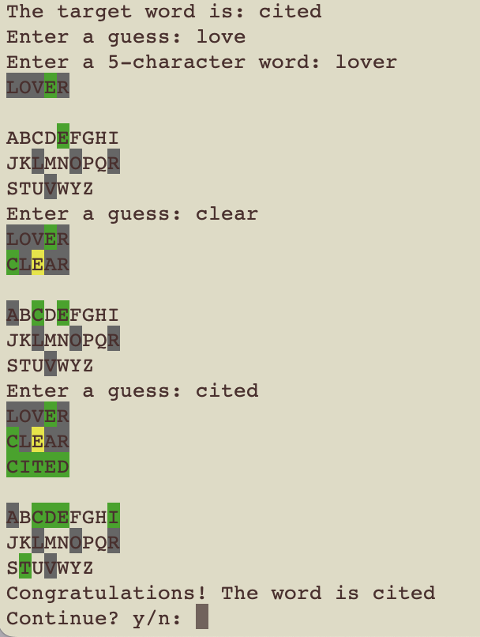

# word-processing-game

This is a Wordle-like program
- The player guesses a word and receives feedback on how close their guess was to the solution word
- For each letter in the solution word, the game tells the player if the letter is <ins>*in the correct location*</ins>, if the letter exists in the word but is <ins>*not in the correct location*</ins>, or if the letter does <ins>*not exist in the word*</ins>
- The player gets 6 attempts to figure out the word

If you’ve never played the official version before, you can try it [here](https://www.nytimes.com/games/wordle/index.html)

## Design
- Get the list of acceptable solution words and store it in an ArrayList
- Randomly select a solution word and delete it from the list of the solution words
- Prompt the user to guess the word and give them feedback (6 times at maximum)
- Ask the user to play again or quit after the game finishes
- After the user indicates that they don't want to continue playing, write the game history out to a file

## Display
Below is the display of the game.

